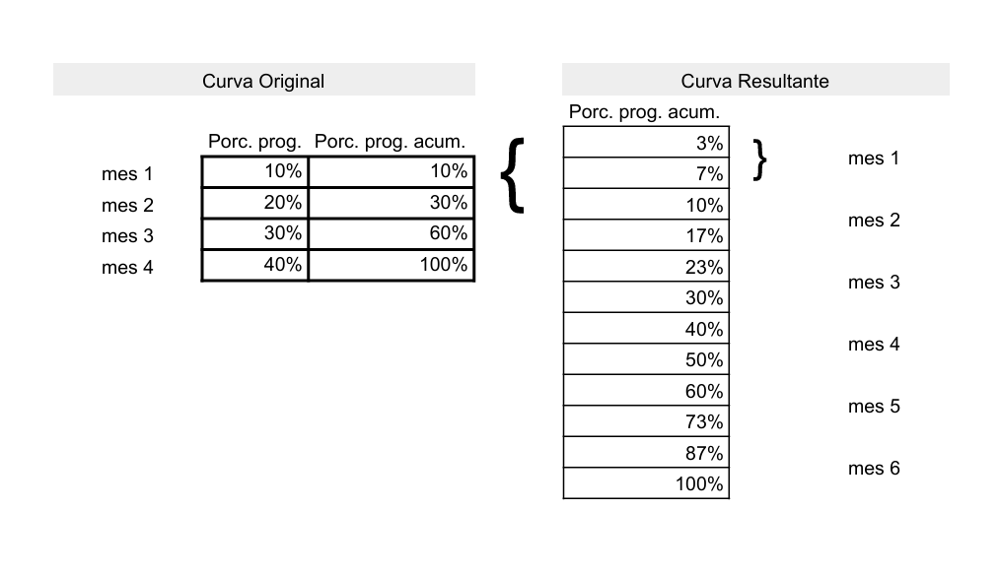
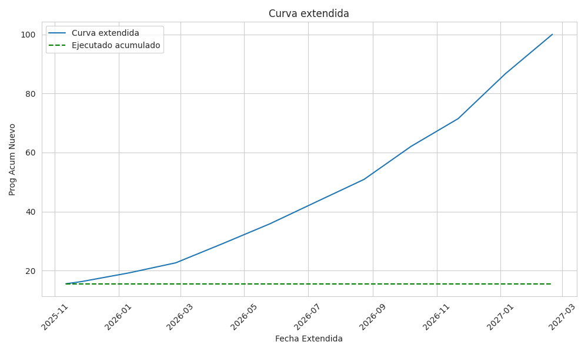

  

## Diplomado de Python para Ingenieros - FIUNA
# Ajuste y Extension de Curvas de Ejecucion ( ### Smoothing free-form curves )

> Este repositorio contiene el trabajo final en el marco del Diplomado de Python para Ingenieros organizado por [Facultad de Ingenieria - UNA].

## 🔍 Overview

Las obras civiles se enmarcan en un cronograma para su ejecucion, el mismo cronograma se expresa como porcentajes de ejecucion sobre el monto total estimado. De esta
manera podemos proyectar los montos que se esperan desembolsar en obras por año.
Si bien estas curvas programaticas sirven de referencia, siempre existe un desfase (positivo o negativo) entre la ejecucion real y la esperada segun el cronograma.
El objetivo de este proyecto es desarrollar una metodología de re-proyección. Primero, se ajustará la curva programática restante, partiendo del avance real ejecutado a la fecha. En segundo lugar, se simulará un escenario de contingencia donde se implementa una extensión del plazo del 50% sobre la duración original de la obra, con el fin de proyectar su nuevo perfil de desembolsos anuales.

---

## ⚙️ Desafios - Metodologia

Algunas de las ideas iniciales para resolver el problema de la extension del plazo, buscando que la curva resultante tenga un comportamiento en lo mas parecido a su
curva original fueron:
- Aplicar metodos de machine learnig: (No poseemos datos historicos suficientes para entrenar un modelo, ni el tiempo necesario para desarrollarlo)
- Aplicar un factor a cada avance programado mensual para "relentizar" la curva: (Si el factor fuera P habria un factor (1-P) de los avances de las curvas
faltarian distribuir al final de la curva programada
- Linearizar las curvas: reducir el Avance Mensual de las curvas a Avance mensual= 100% / Plazo*1,5 (las curvas tienen comportamientos variados y al aplicar eso
a muchas curvas, que son mas de 100, el error de aproximacion incrementa)

---

## 💡 Metodologia Final

Lo que se busca lograr es analogo a decir que el avance que tenia planificado para un mes, realmente lo hare en 1,5 meses.
La metodologia final utilizada sera una suerte de artificio matematico dado que
3/2 = 1,5
cada avance mensual redistribuire en 3 partes y estas partes las agrupare en pares.
Luego ajustare la curva resultante a partir del avance ejecutado acumulado, Corriendo la fecha actual desde ese Avance

### 🛠️ Herramientas y Librerias

- `Google Colab` (Python)
  -Librerias:
  numpy/
  pandas/
  datetime/
  matplotlib.pyplot/
  seaborn/
  gspread/
  gspread_dataframe/
  google.auth/
  google.colab 
  
- `GitHub` (Portfolio)
---

## 📊 Resultados

### Curva Programada y Avance ejecutado a la fecha

En el cruce de la curva programada y el avance ejecutado a la fecha, se puede apreciar que la ejecucion se encuentra levemente adelantada con respecto a lo
programado, y que a partir de ese punto quedan 11 meses para finalizar la obra.

### Curva Extendida a partir del punto de avance actual

En la curva extendida podemos apreciar como la nueva programacion parte del avance ejecutado a la fecha y el nuevo plazo pendiente es de 16 meses.
Confirmandose que el plazo nuevo vs el plazo inicial = 1,5
